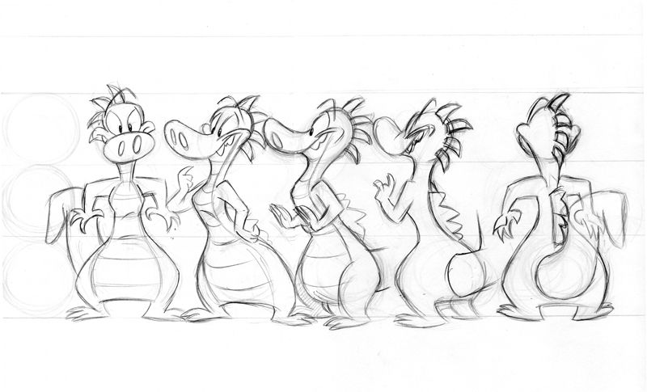
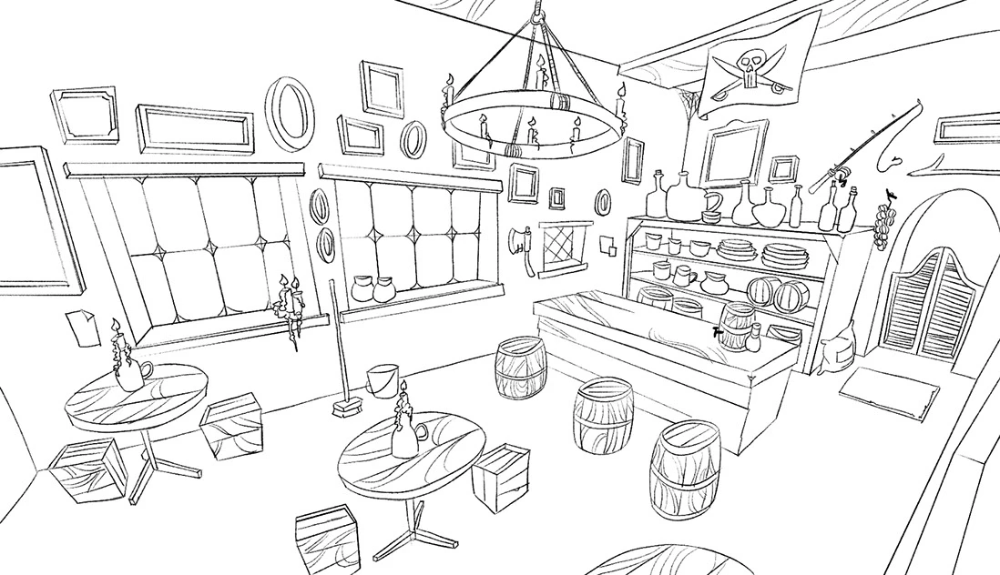

### Design (Personagens e Cenários)
Exploração de ideias por variações: silhueta, proporção, forma, paleta, materiais.

Personagens
- Turnarounds (frente/lado/costas)
- Poses-chave e expressões
- Paleta base e variações
- Props e relação de escala

Cenários
- Thumbnails de composição
- Chaves de luz (lighting keys)
- Paleta por ambiente
- Lista de props/foliage/FX

Checklist
- [ ] Silhuetas legíveis
- [ ] Proporções consistentes no turnaround
- [ ] Paleta compatível com o [[Colour Script]]
- [ ] Referências (3–5) por item

Assets visuais

Vídeo (character design)
<iframe width="560" height="315" src="https://www.youtube.com/embed/JJYz76bEBHs" title="Character Design Crash Course" frameborder="0" allow="accelerometer; autoplay; clipboard-write; encrypted-media; gyroscope; picture-in-picture; web-share" referrerpolicy="strict-origin-when-cross-origin" allowfullscreen></iframe>
